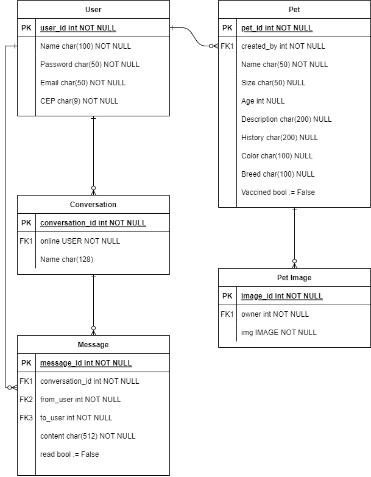

# API do site PET-AMIGO
Esse documento descreve os passos necessários para a criação do ambiente de desenvolvimento e manutenção das APIs do projeto.

## Requisitos
Os requisitos necessários para o acesso as funcionalidades do projeto são o Python na versão 3.8 juntamente com o pip 20.0.2 (versão que vem em conjunto com o python 3.8)

## Inicializando o projeto
É preciso baixar a biblioteca para criar o ambiente virtual do Django, com o comando 
```
pip3 install virtualenv
```
Após isso caso esteja usando ubuntu ou alguma distribuição linux é possivel iniciar o ambiente com:
```
. ./bin/setup_env_ubuntu.sh  
```
Caso contrario use 
```
python3 -m venv venv
pip3 install -r requirements.txt
```
Com isso todas as dependencias do projeto estão configuradas
## Subindo o servidor do backend
Para criar as entidades no banco é preciso rodar as migrações:
```
python3 manage.py migrate --settings=petamigo.settings.development
```
O "--settings=petamigo.settings.development" é necessario para rodar o comando com as configurações de desenvolvimento, quando for iniciar em produção use "--settings=petamigo.settings.production", por fim, é póssivel iniciar o servidor do backend com 
```
python3 manage.py runserver --settings=petamigo.settings.development
```

## Estrutura de pastas
A estrutura de pastas do projeto segue o padrão do Django, inicialmente existe a pasta com o nome do projeto(no nosso caso petamigo) que vai guardar as configurações inciais. Cada modulo novo criado vai ser adicionado ao arquivo settings.py em INSTALLED_APPS bem como outras configurações que forem necessarias

Para criar um modulo novo usamos o comando
```
python3 manage.py startapp nome_do_modulo
```
será criado uma nova pasta com os arquivos iniciais do Django, no nosso projeto temos os modulos de users,pets e chats. Cada um deles vai ter seu arquivo models.py descrevendo os campos presentes no modelo e suas funções,serializer.py que é usado para permitir que sejam feitas queries nos modelos, views.py que vai tratar as requisições e urls.py que vai definir as rotas referentes aquele modulo.

## Testes

Também em cada modulo, existe o arquivo tests.py em que está escrito testes unitarios do modulo, pode ser de grande ajuda para entender os formatos de requisição para aplicação, para rodar os testes use:
```
python3 manage.py test nome_do_modulo
```
por exemplo
```
python3 manage.py test users
```

## Diagrama do banco de dados
Segue o diagrama entidade-relacionamento do banco:

